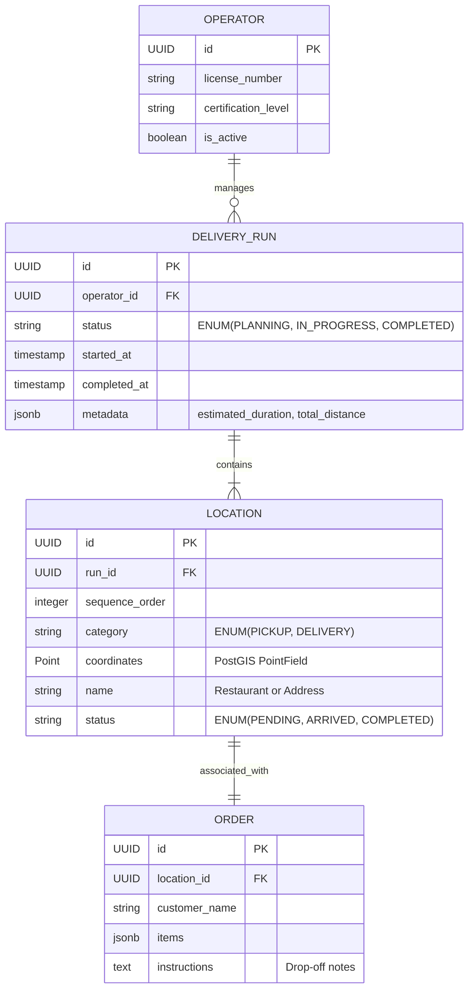

# Data Model: Drone Delivery Run

## Entity Overview

The system architecture follows a decoupled model where the Backend manages spatial data and run state, while the Frontend visualizes these entities.

## Schema Details

### 1. DeliveryRun
- **Description**: The top-level container for a journey.
- **Constraints**: 
    - At least 1 Location required.
    - End time must be after start time.

### 2. Location
- **Description**: A waypoint in the run.
- **Field Details**:
    - `coordinates`: Django `PointField` (SRID 4326).
    - `sequence_order`: Determines the flight path connectivity.
- **Validation**:
    - `PICKUP` locations should generally precede `DELIVERY` locations for the same order (though not strictly enforced for multi-pickup runs).

### 3. Order
- **Description**: Delivery metadata.
- **Field Details**:
    - `instructions`: Essential for Residential deliveries (FR-003/Story 3).

## State Transitions

### DeliveryRun State
- `PLANNING` -> `IN_PROGRESS` (on takeoff/start)
- `IN_PROGRESS` -> `COMPLETED` (when all locations are COMPLETED)

### Location State
- `PENDING` -> `ARRIVED` (when drone reaches geofence/manual toggle)
- `ARRIVED` -> `COMPLETED` (on pickup/drop-off confirmation)
