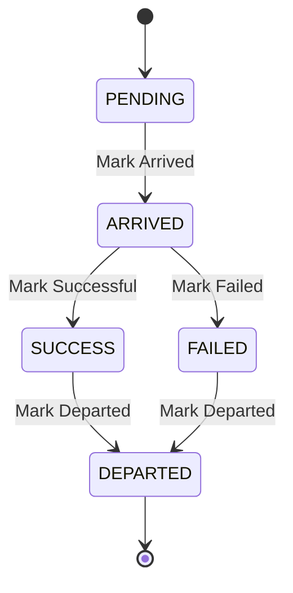

# Data Model: Drone Operator Delivery Flow

## Entities

### Dispatcher
Represents a coordinator who monitors route execution and receives alerts.

| Field | Type | Description |
| :--- | :--- | :--- |
| `id` | UUID | Primary key |
| `user` | ForeignKey(User) | The user associated with the dispatcher role |
| `is_active` | Boolean | Whether the dispatcher is currently on duty |

## State Transitions (Stop)

## Relationships
- `Route` has many `Stops`.
- `Stop` is uniquely identified within a `Route` by its `id` and ordered by `sequence`.
- `Operator` maps to `User` for authentication.
- `Dispatcher` monitors multiple `Routes`.
